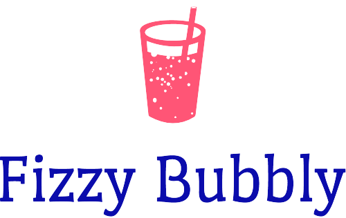

# Fizzy Bubbly : A Coding Project

Fizzing and Bubbling all the way! Counting from 1 to 100, if the
number is a multiple of Fizzy it's Fizz.
If it's a multiple of Bubbly, it's a Buzz.
If it's both, OH Boy, it's FizzBuzz!
Enter each number in it's own input and see what happens.

All logos were created thanks to Jimdo.
https://www.jimdo.com/
